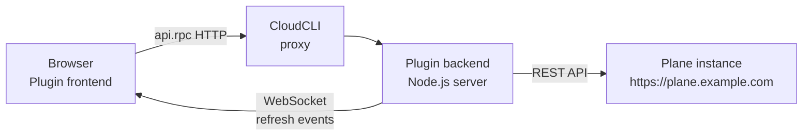

# cloudcli-plugin-plane

Plane project management tab for [CloudCLI](https://github.com/TadMSTR/cloudcli). Browse issues, transition states, create tickets, and track cycles — without leaving your terminal UI.

---

## Data flow



---

## Features

| Feature | Description |
|---------|-------------|
| My Issues | Default landing view — assigned issues grouped by state (started > unstarted > backlog) |
| Multi-project | Switch between all projects in your workspace |
| Issue list | Paginated list with state dot, priority icon, identifier, title, due date |
| Filtering | Filter by state group, priority, assignee, label, or cycle |
| Quick-filter presets | One-click filters: My open, High priority, Overdue |
| Search | Client-side search across issue title and sequence ID |
| Sort controls | Sort by newest, priority, updated, or due date |
| State transitions | Inline state dropdown on each row — updates optimistically |
| Issue detail | Full description, state/priority controls, labels, assignees, due date, comments |
| Comments | Add comments from the detail view |
| Sub-issues | Parent link, child count indicator, navigable sub-issue list in detail |
| Inline create | Create issues with title, description, priority, label, assignee (default assignee pre-selected) |
| Cycle view | Filter to current cycle issues via the cycle dropdown |
| Issue count badges | State group counts shown as clickable badges to filter |
| Overdue flagging | Due dates past today shown in error color for non-completed issues |
| Keyboard navigation | `j`/`k` to move, `Enter` to open, `c` to create, `/` to search, `Esc` to clear/back, `s`/`p` for state/priority in detail |
| Responsive layout | Adapts to narrow widths (<480px) via ResizeObserver |
| Open in Plane | Direct link from detail view to the issue in Plane |
| Dark/light theme | Follows CloudCLI host theme, switches without reload |
| Live updates | WebSocket connection pushes refresh events after mutations |

---

## Installation

1. Open CloudCLI → **Settings** → **Plugins**
2. Paste the GitHub URL: `https://github.com/TadMSTR/cloudcli-plugin-plane`
3. CloudCLI installs and builds the plugin automatically

Or install manually:

```bash
PLUGIN_DIR=~/.claude-code-ui/plugins/cloudcli-plugin-plane
mkdir -p "$PLUGIN_DIR"
git clone https://github.com/TadMSTR/cloudcli-plugin-plane.git /tmp/cpp
cd /tmp/cpp && npm install && npm run build
cp -r dist manifest.json package.json node_modules "$PLUGIN_DIR/"
```

---

## Configuration

Create `~/.claude-code-ui/plugins/cloudcli-plugin-plane/config.json`:

```json
{
  "planeUrl": "https://plane.example.com",
  "apiKey": "plane_api_xxxxxxxxxxxxxxxx",
  "workspaceSlug": "your-workspace"
}
```

| Field | Description |
|-------|-------------|
| `planeUrl` | Base URL of your Plane instance |
| `apiKey` | API token from Plane → Settings → API Tokens |
| `workspaceSlug` | Your workspace slug (visible in Plane URLs) |

The config file is read on every request — no restart needed after changes.

If the file is missing or incomplete, the plugin shows a setup prompt with the expected format.

After creating the file, restrict its permissions — it contains your API key:

```bash
chmod 600 ~/.claude-code-ui/plugins/cloudcli-plugin-plane/config.json
```

---

## Development

```bash
git clone https://github.com/TadMSTR/cloudcli-plugin-plane.git
cd cloudcli-plugin-plane
npm install
npm run build
```

The build script runs `tsc --noEmit` for type checking, then bundles frontend (`dist/index.js`) and backend (`dist/server.js`) via esbuild.

To test against a live Plane instance, install to your local CloudCLI plugins directory and create the config file above.

---

## Security

- The API key is stored in `config.json` on your local machine only — never transmitted to third parties
- The plugin backend binds to `127.0.0.1` on an ephemeral port — not accessible outside localhost
- All Plane API calls go directly from the plugin backend to your Plane instance
- No telemetry, no analytics, no external calls except your configured `planeUrl`
